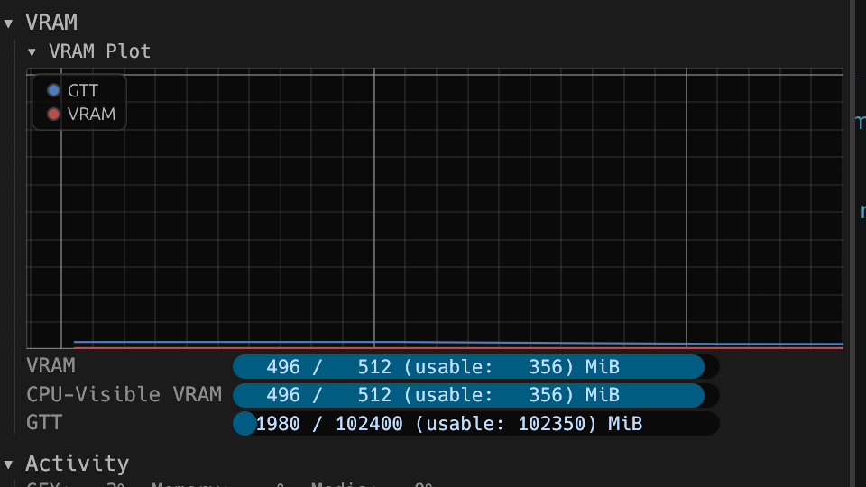

# Rocm installation

### To install Rocm from official repo of AMD. 

Adding repo to `dnf`. Change version if new Rocm is available. Also, if new Red Hat Linux version is released.

```bash
sudo dnf install https://repo.radeon.com/amdgpu-install/7.2.1/rhel/10.1/amdgpu-install-7.2.1.70201-1.el10.noarch.rpm
```

Then add current user into two groups

```bash
sudo usermod -a -G render $USER
sudo usermod -a -G video $USER
```

Install Rocm

```bash
sudo dnf install rocm
```

To check installation you can run 
```bash
rocminfo
```
or
```bash
amd-smi
```
The latter will output something like this
```
+------------------------------------------------------------------------------+
| AMD-SMI 26.2.2+e1a6bc5663    amdgpu version: Linuxver ROCm version: 7.2.1    |
| VBIOS version: 00107962                                                      |
| Platform: Linux Baremetal                                                    |
|-------------------------------------+----------------------------------------|
| BDF                        GPU-Name | Mem-Uti   Temp   UEC       Power-Usage |
| GPU  HIP-ID  OAM-ID  Partition-Mode | GFX-Uti    Fan               Mem-Usage |
|=====================================+========================================|
| 0000:c4:00.0  Radeon 8060S Graphics | N/A        N/A   0                 N/A |
|   0       0     N/A             N/A | N/A        N/A              499/512 MB |
+-------------------------------------+----------------------------------------+
+------------------------------------------------------------------------------+
| Processes:                                                                   |
|  GPU        PID  Process Name          GTT_MEM  VRAM_MEM  MEM_USAGE     CU % |
|==============================================================================|
|  No running processes found                                                  |
+------------------------------------------------------------------------------+
```

or

```bash
sudo dmesg | grep 'amdgpu.*memory'
```

Which will output VRAM and GTT memory available on the system
```
[    8.300937] amdgpu 0000:c4:00.0: amdgpu: amdgpu: 512M of VRAM memory ready
[    8.300942] amdgpu 0000:c4:00.0: amdgpu: amdgpu: 102400M of GTT memory ready.
```


# Change GTT memory settings

To change GTT memory execute these commands. This is an example of setting 100Gb RAM to be available for GTT on AMD Ryzen AI Max+. Where `26214400` are the count of pages by 4Kb each, making `26214400*4=104857600` bytes (`100Gb`)


```bash
sudo grubby --update-kernel=ALL --args="amdgpu.gttsize=-1 ttm.pages_limit=26214400 ttm.page_pool_size=26214400 ttm.ttm_limit_pages=26214400"

sudo grub2-mkconfig -o /boot/grub2/grub.cfg

sudo reboot
```

To check available GTT memory use `AMDGPU TOP`, or `Mission Center`



# Installing PyTorch with support for Ryzen AI Max+

While we are waiting for dull support of AMD Ryzen AI Max+ by PyTorch, you can use specially compiled wheels from AMD repos.

Repository link to Rocm PyTorch compiled wheels. https://repo.radeon.com/rocm/manylinux/rocm-rel-7.2/

If you use Python v3.13, then all what you need is to download these files:
```
torch-2.9.1+rocm7.2.1.lw.gitff65f5bc-cp313-cp313-linux_x86_64.whl
torchvision-0.24.0+rocm7.2.1.gitb919bd0c-cp313-cp313-linux_x86_64.whl
torchaudio-2.9.0+rocm7.2.1.gite3c6ee2b-cp313-cp313-linux_x86_64.whl
triton-3.5.1+rocm7.2.1.gita272dfa8-cp313-cp313-linux_x86_64.whl
```
At this moment only Python versions 3.10 up to 3.13 is supported in that repo, but it could be changed soon. So, always check when version is available. I really hope AMD will step up and help with official PyTorch so we can skip doing these steps. :)

That should cover most of AI workflows.

To install these files into Python local environment follow these steps:

1. If you installed PyTorch already, uninstall it by running this command, otherwise skip to **2.**

```bash
pip3 uninstall torch torchvision triton torchaudio
```

2. Then execute this

```bash
pip3 install torch-2.9.1+rocm7.2.1.lw.gitff65f5bc-cp313-cp313-linux_x86_64.whl torchvision-0.24.0+rocm7.2.1.gitb919bd0c-cp313-cp313-linux_x86_64.whl torchaudio-2.9.0+rocm7.2.1.gite3c6ee2b-cp313-cp313-linux_x86_64.whl triton-3.5.1+rocm7.2.1.gita272dfa8-cp313-cp313-linux_x86_64.whl
```

